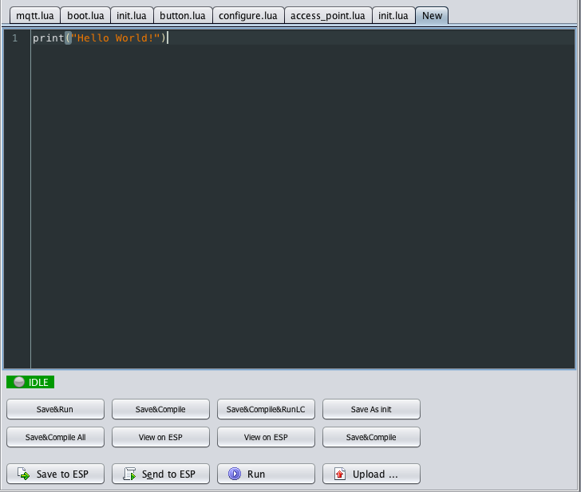

## Hello World!

In this tutorial we will learn how to load a simple **hello world** script into our NodeMCU devkit board using the ESPLorer IDE.

You should follow the introductory tutorial to get your Mac environment ready.

The actual program we are going to write is rather simple. The main focus is the process to get code running and to do so following some best practices to ensure we do not brick our board.

Here is the code we will be running:

```lua
print("Hello World!")
```

Once we have completed this tutorial we should be able to write our own programs and upload them to a NodeMCU board.

### Firing up the IDE

If you don't have the ESPLorer IDE running then open a terminal window, `cd` to the directory containing the **ESPLorer.jar** file and type the following command:

```
sudo java -jar ESPLorer.jar
```

### Connecting to the board
In order for the IDE to talk to the devkit we need to stablish a connection first.

In the top right corner of the IDE:
- Select **/dev/cu.SLAB_USBtoUART** port
- Select 9600
- Click Open


_NOTE:_ If the connection was successful the Open button should toggle to a Close state. If this is not working make sure that you have installed the [SiLabs drivers][silabs-drivers]. If you don't see the /dev/cu.SLAB_USBtoUART option in the dropdown menu also make sure that you installed the drivers and restarted your computer. More information on the [introductory tutorial][intro-tutorial].

### Create a new file
We will create a new file, and name it `init.lua`. When the board boots it looks for a file named `init.lua` and it will automatically execute it on boot.

Because of this, we need to be very careful to not upload a `init.lua` file with errors that will generate a **panic** that will reboot the board. Once booted it will enter a panic reboot infinite loop bricking the board.

It's recommended to keep `init.lua` files really simple and add a guard using a timer. We will cover that up later on.


To create a new file:
- Select NodeMCU tab
- Select Script tab
- Click the blank file icon


- Copy and paste the following code snippet:
    - `print("Hello World!")`
- Click the floppy disk icon and name the file `init.lua`




Next we will upload our file to the board!


### Features

The ESPlorer IDE has a lot of different and useful features that you will discover as you use the program. Here we cover a small sample of those.

Show the current files uploaded in the board:

Send commands:

Snippets:


[silabs-drivers]: https://www.silabs.com/products/mcu/Pages/USBtoUARTBridgeVCPDrivers.aspx
[intro-tutorial]: https://github.com/goliatone/esp8266-intro

<!--
http://stackoverflow.com/questions/31304082/how-to-recover-nodemcu-infinite-loop
-->
